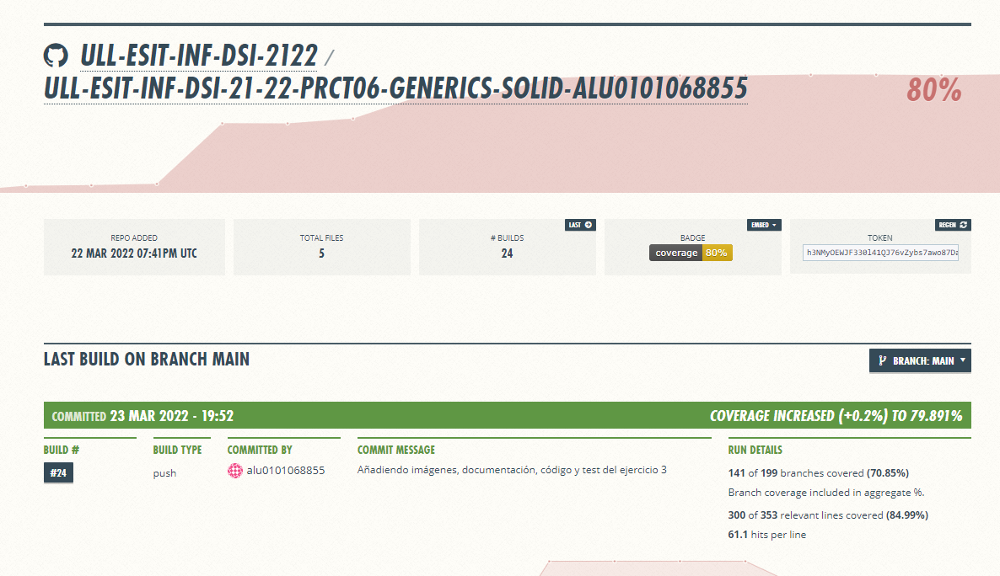

# Práctica 6 DSI
Héctor Abreu Acosta (alu0101068855).

**Atención**
¡¡¡Hacer click en la imagen de debajo para el valor verdadero del coverage!!!

[Enlace](https://ull-esit-inf-dsi-2122.github.io/ull-esit-inf-dsi-21-22-prct06-generics-solid-alu0101068855/) del informe de la práctica

Imagen Coveralls:

