# Práctica 5 - Objetos, clases e interfaces

## Ejercicio 1 - Pokedex
Para este ejercicio, se han realizado 3 clases: ```class Pokémon```, ```class Pokédex``` y ```class Combat``` cuyo objetivo es simular un **combate Pokémon** y tener una **Pokédex** donde almacenar los datos de varios **Pokémon**.

### Clase Pokémon
Esta clase cuenta con 4 métodos **privados** que contienen el nombre de tipo *string*, el peso y la altura almacenados en un *array*, el tipo del Pokémon en un *string* y sus estadísticas (**HP**, **AT**, **DEF**, **VEL**) ordenadas en un *array*. Inicializamos el constructor con los parámetros nombrados anteriormente y realizamos las asignaciones propias.

Continuamos con los métodos getter() y setter() para poder acceder a estos valores desde fuera de la clase. Cabe decir que en los getter de los arrays, se ha optado por poner el array entero y por dividirlos también. En el ejemplo de **Peso y Altura**, tenemos el *getter* del *array* con los dos valores y también los *getter* de solo el peso o solo la altura. Lo mismo sucede con las estadísticas (**getHP()**, **getAT()**, **getDEF()**, **getVEL()**).

**Nota:** Para ahorrar líneas de código, si en el *constructor* asignamos el tipo (**private** / **readonly** / **protected**, etc) a los nombres de los parámetros que recibe la clase, no hace falta realizar la asignación después, es decir que si lo hacemos de esta manera, luego no hay que asignarlos con los **this.nombre = nombre** por ejemplo. 

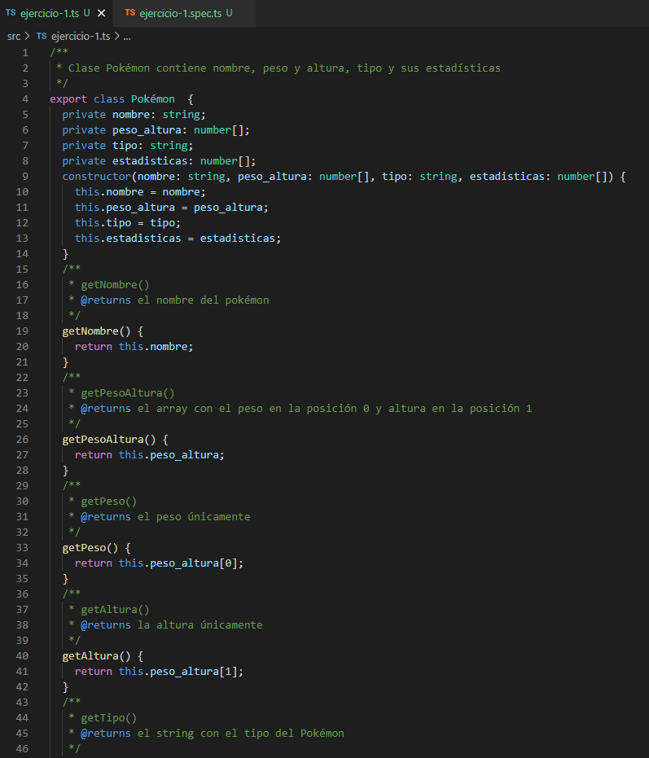

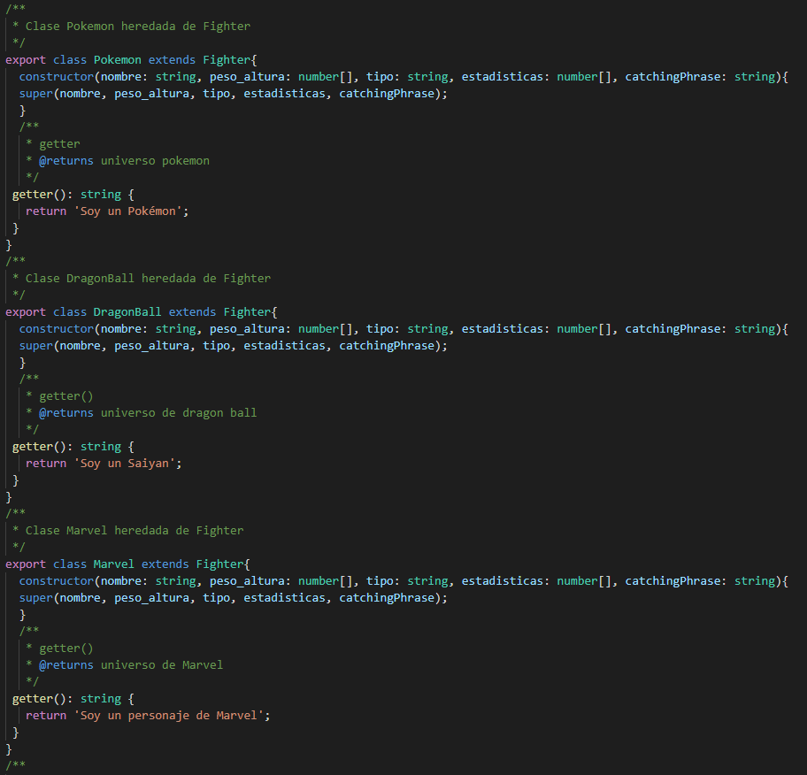

#### Setters de la clase Pokémon
Para los *setters*, recibimos el tipo de dato a modificar con el método y luego lo cambiamos. En el caso de los *setters* de arrays como en el caso de las estadísticas, se puede modificar el *array* entero introduciendo un *array* de *números* o podemos modificar sólo una de las estadísticas mediante un *number* que modifica luego el *array*. El caso de ```setHP(numero)``` modifica con el *número* introducido el valor **HP** del *array* únicamente. 

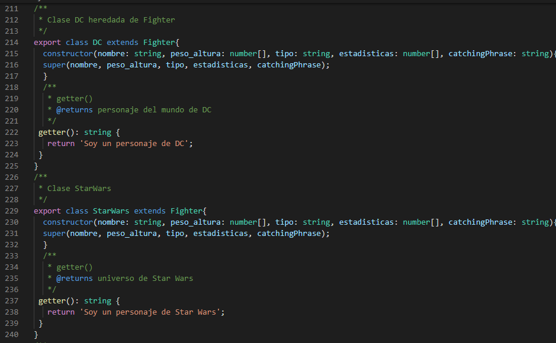


### Clase Pokédex
La clase **Pokédex** contiene únicamente un *array* de **Pokémon**, cuyo objetivo es almacenar objetos de la clase **Pokémon**. Además consta de 2 métodos ```getPokemonNumeros()``` que cuenta el número de los **Pokémon** que contiene la **Pokédex** y ```printPokedex()``` que muestra los datos formateados de todos los **Pokémon** que contiene la **Pokédex**.

**Nota:** Para el caso del método ```printPokedex()``` podría ser mejor opción el que se hubiese creado una clase con el mismo nombre que cumpliera su misma función, ya que en los principios **SOLID**, el primer principio: **Single responsibility principle**, las clases deberían realizar una única tarea.  

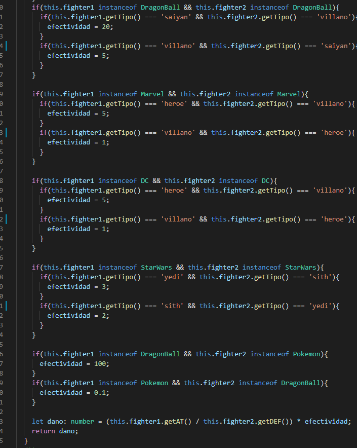

### Clase Combat
En esta clase se simula un **combate** entre dos **Pokémon**, con lo cual eso será lo que recibe dicha clase. Cuenta con 3 métodos ```entrenadorPokemon1()``` y ```entrenadorPokemon2()``` que es código modificado de la [práctica 3](https://github.com/ULL-ESIT-INF-DSI-2122/ull-esit-inf-dsi-21-22-prct03-types-functions-alu0101068855), [ejercicio 8](https://github.com/ULL-ESIT-INF-DSI-2122/ull-esit-inf-dsi-21-22-prct03-types-functions-alu0101068855/blob/main/src/ejercicio8.ts) concretamente. Estos métodos devuelven el **daño** que le inflige el **pokemon1** al **pokemon2** en el primer caso y el daño del **segundo** al **primero** en el segundo caso. También tiene en cuenta la **efectividad** del ataque, el **AT** del atacante y la **DEF** del defensor.

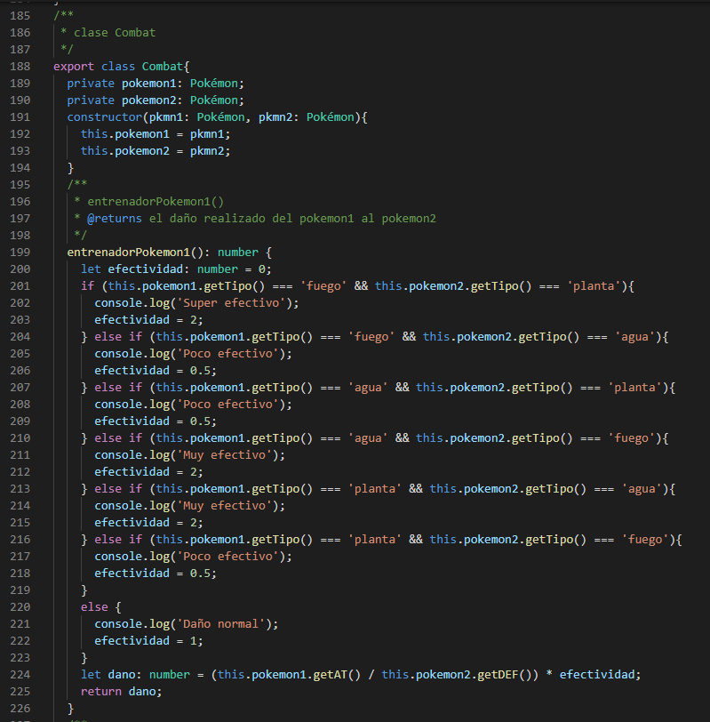

Finalmente tenemos el método  ```start()``` que simula el combate entre dichos pokémon mostrando los resultados de cada **turno**. Cuenta los turnos y en este caso se ha establecido que la condición por la que se detenga el combate es que uno de los dos acabe con 0 o menos puntos de vida **HP**. 

El **primer Pokémon** ataca y se reescribe el **HP** del segundo mediante la resta del daño calculado por el método ```entrenadorPokemon1()```. Si la vida del segundo es menor o igual a 0, quiere decir que se ha debilitado y por tanto el primero ha resultado victorioso. Si sobrevive, el segundo ataca al primero, realizando la misma metodología, pero con el uso del método ```entrenadorPokemon2()``` y viendo que si el primero resiste o no el golpe. Se repite dicho bucle hasta que haya un vencedor.

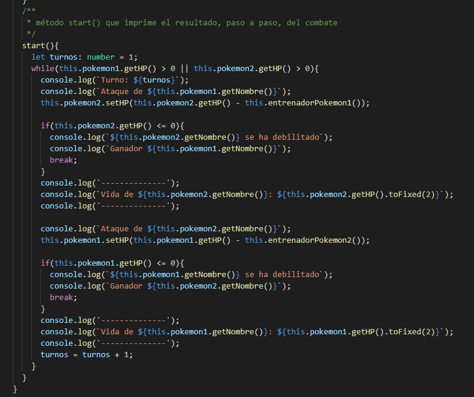

En las siguientes imágenes se puede ver cómo sería la simulación del combate entre **Charmander** y **Bulbasur**.

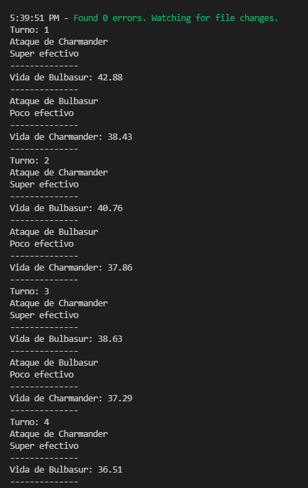

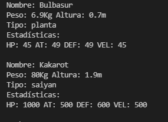

**Nota:** en el guión de la práctica se ha establecido que se debería acabar cuando el daño sea mayor o igual a la vida de uno de los 2 contrincantes. Cambiando el bucle ```while()``` y sumando los daños en vez de restarlos a la **HP**, podríamos lograr este cambio.
Otro posible cambio es el de comparar las **VEL** de los Pokémon para determinar el que empieza el ataque, pero en el guión indica que quien ataca primero es el primero llamado, es decir el primer **Pokémon** y, en este caso, se ha respetado esa condición.

## Ejercicio 1 tests - Pokedex  

Para los test se han comprobado las clases únicamente. Se han creado 3 Pokémon (Bulbasur, Squirtle y Charmander) y se han analizado las clases.

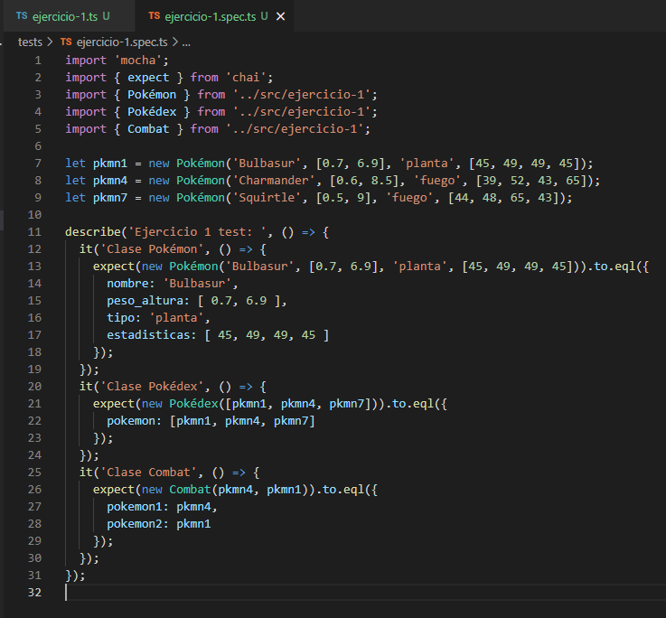

En el caso de la **clase Pokémon** introducimos a Bulbasur y comprobamos que se ha creado el Objeto con los valores introducidos.
Para la **clase Pokédex**, se ha creado una Pokédex de los 3 pokemon y luego se comprueba que se ha generado el array con los 3 pokemon.
Finalmente, se comprueba que se crea la **clase combat** a partir de dos pokemon.

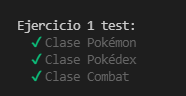

## Ejercicio 2 - Conecta 4

Para el desarrollo de **Conecta 4** se ha optado por usar 4 clases ```clase Rejilla()``` ```clase Jugador1()``` ```clase Jugador2()``` ```clase Conecta4()```.
La clase ```clase Rejilla()``` contiene un *array* de *arrays* de *strings*, lo que forma una **matriz** nxm (en este caso se ha rellenado de '0' y su tamaño es estrictamente 6x7). Cuenta con 2 getter, 1 setter y un método ```print()```. ```getTamano()``` devuelve el tamaño de la rejilla (42).  ```getValor(i,j)``` devuelve el valor que hay en la posición i,j. ```setValor(valor, fila, columna)``` sobreescribe el **valor** que hay en la **fila** y **columna** introducidas. ```printRejilla()``` simplemente muestra el tablero.

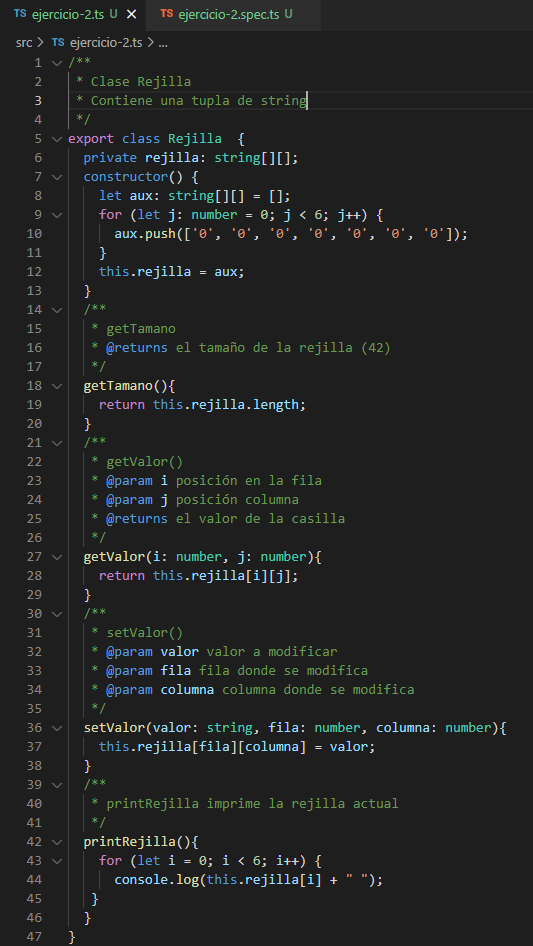

```clase Jugador1()``` contiene el número de fichas de cada jugador, y el tipo de ficha 'R' que indica el color de la ficha. La clase contiene 2 getter y 2 setter.
```getFichasN()``` devuelve las fichas que tiene el jugador 1, ```getFichasTipo()``` contiene el tipo/color de la ficha. ```setFichasN(fichasn)``` modifica el total de fichas del jugador. ```setFichasT(fichast)``` modifica el valor de la ficha del jugador.

La ```clase Jugador2()``` es una clase heredada de la ```clase Jugador1()``` cuyo único cambio es el Tipo de fichas que es 'A' en este caso.

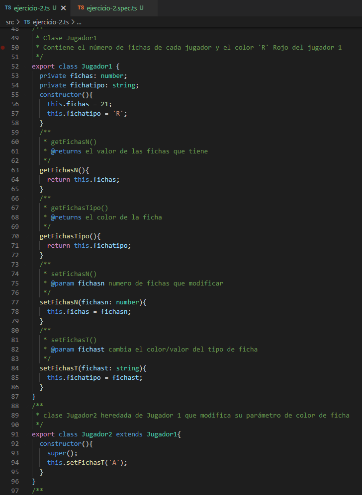

Para que el usuario pueda introducir valores por consola se ha importado [readline](https://nodejs.org/api/readline.html), cuya variable es **rl**.

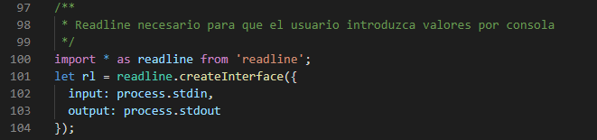

La ```clase Conecta4()``` recibe los jugadores 1 y 2 y la Rejilla en la que se va a jugar. Contiene 2 métodos ```comprobar()``` y ```start()```.
```comprobar()``` recorre la rejilla y busca los valores de las fichas para cada jugador y cada vez que se mete una ficha, comprueba los valores de 'R' y 'A': 
- **Horizontalmente** si las fichas en orden horizontal i - 1/2/3, j tienen el mismo valor de la ficha, lo que quiere decir que hay 4 seguidas y por tanto hay un ganador.
- **Verticalmente** si las fichas en orden ascendente i, j + 1/2/3 tienen el mismo valor de la ficha, lo que quiere decir que hay 4 seguidas y por tanto hay un ganador.
- **Diagonalmente** si las fichas en sentido diagonal i + 1/2/3, j + 1/2/3 tienen el mismo valor de la ficha, lo que quiere decir que hay 4 seguidas y por tanto hay un ganador.
- **Diagonal invertida** si las fichas en sentido diagonal inverso i - 1/2/3, j - 1/2/3 tienen el mismo valor de la ficha, lo que quiere decir que hay 4 seguidas y por tanto hay un ganador.

Cuando una de las condiciones se cumple, se hace un ```rl.close()``` lo que finaliza la lectura de consola.

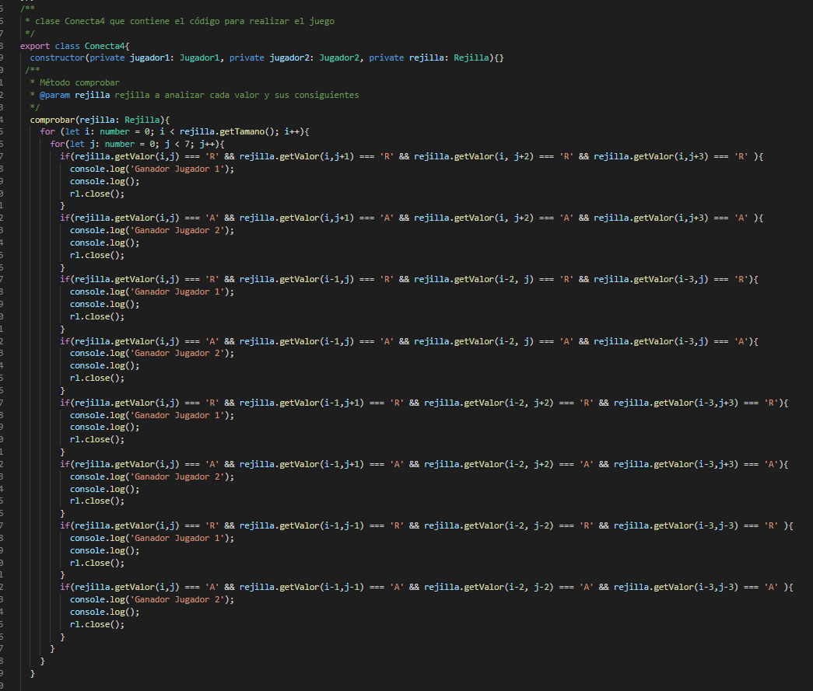

```start()``` da comienzo al juego. contiene 8 contadores, uno para los **turnos** y 7 para las **filas** y **columnas**. Lo primero que hace es mostrar el turno actual (1) y turno del jugador 1 como primera vez, luego empieza a leer por consola los **answer** del jugador. Si el turno es **impar** juega el jugador 1 y si es **par** le toca al jugador2. Se introduce la ficha en la columna deseada y se recorta el valor de la fila para no sobreescribir el resultado. En el caso de que la fila sea 0, simplemente la muestra. 

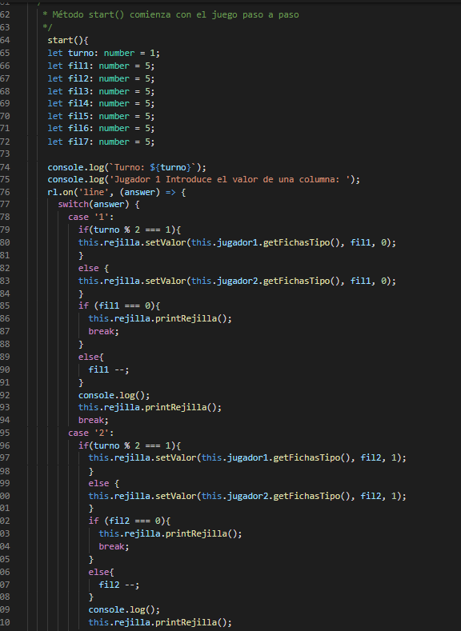

Se le suma 1 al valor de **turno** y se realiza la comprobación de si hay algún ganador, luego muestra el turno actual y continúa con la ejecución. En el caso de que el turno sea el 42 (rejilla llena) se crea una nueva y se resetea el valor de turno a 1. 
Con ```rl.prompt()``` seguimos pidiendo valores al usuario. Finalmente, fuera de las clases se crean los objetos y se inicia el juego.

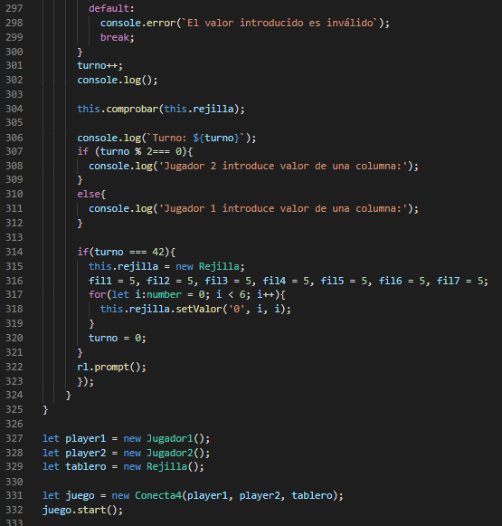

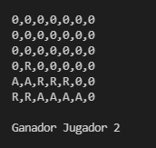

*Imagen de Ganador en Horizontal*

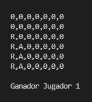

*Imagen de Ganador en Vertical*

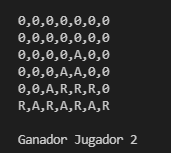

*Imagen de Ganador en Diagonal*

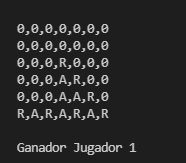

*Imagen de Ganador en Diagonal Inversa*

## Ejercicio 2 tests - Conecta 4

Para los test, se ha comprobado que las clases almacenan correctamente los datos y clases.

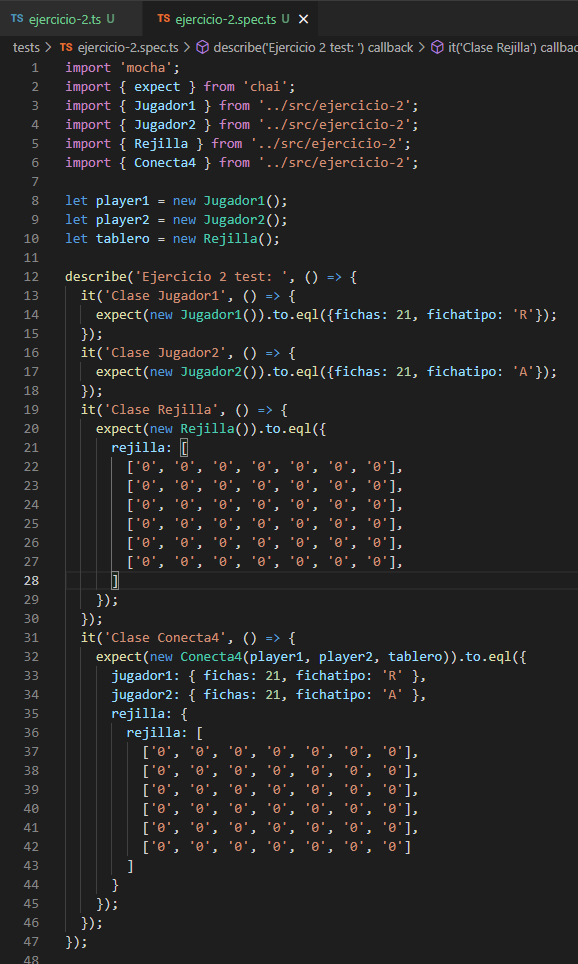

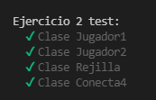

*Imagen de Test*
