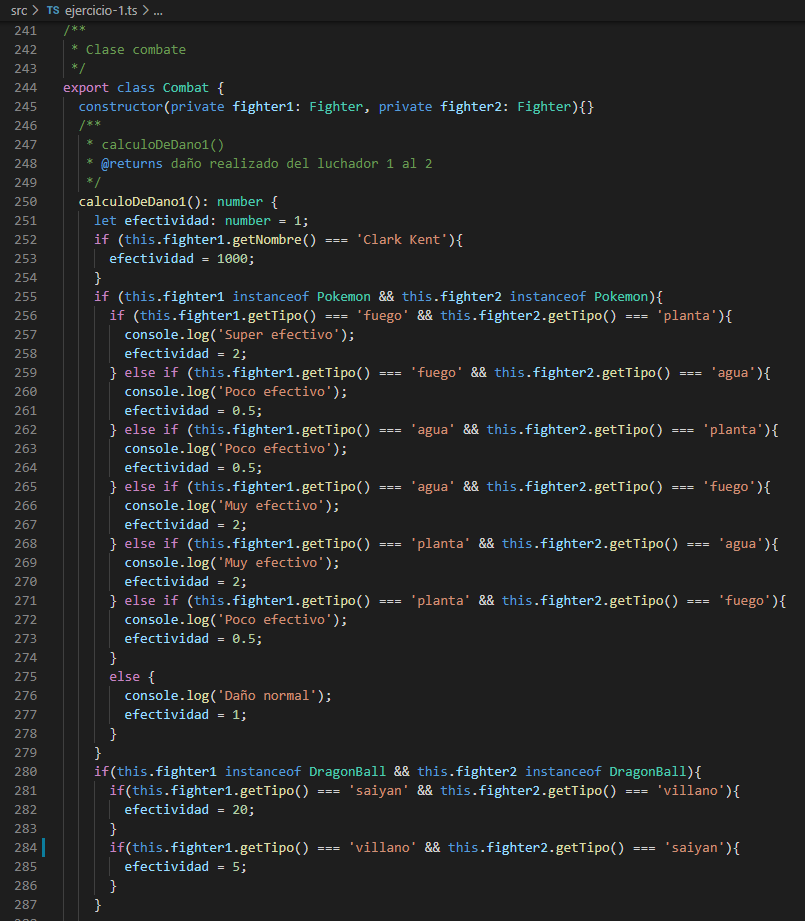
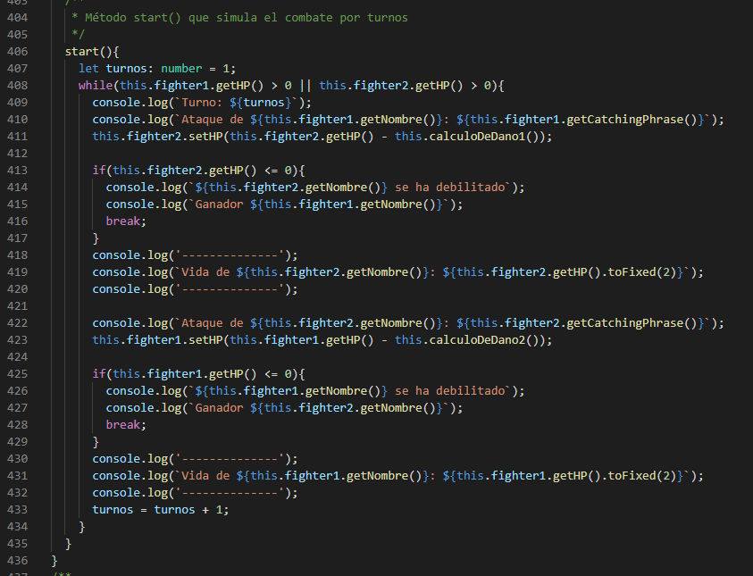
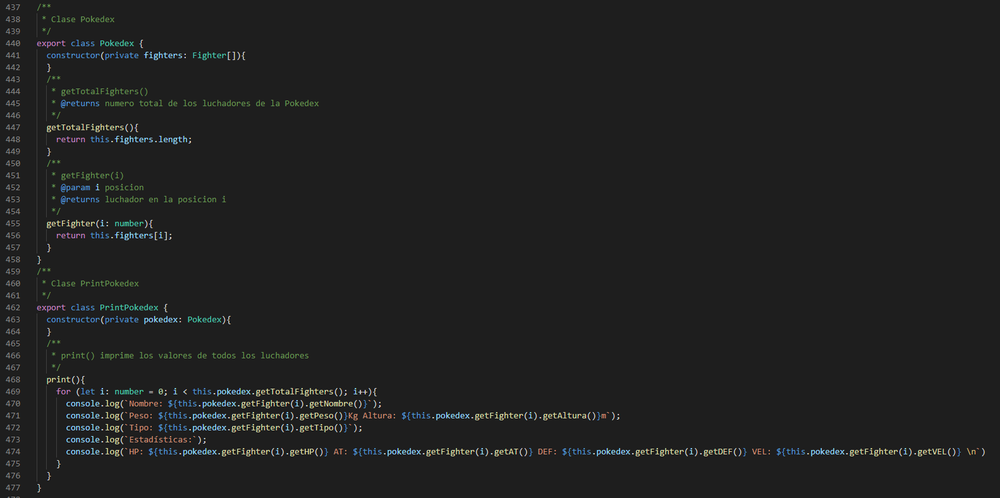
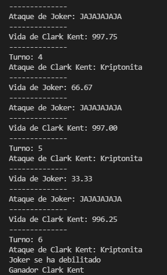

# Practica 6
## Ejercicio 1 - El combate definitivo

Para el desarrollo de esta práctica se ha reutilizado y modificado el código de las prácticas anteriores: 
1. El [ejercicio 8](https://github.com/ULL-ESIT-INF-DSI-2122/ull-esit-inf-dsi-21-22-prct03-types-functions-alu0101068855/blob/main/src/ejercicio8.ts) de la [práctica 3](https://github.com/ULL-ESIT-INF-DSI-2122/ull-esit-inf-dsi-21-22-prct03-types-functions-alu0101068855). 
2. El [ejercicio 1](https://github.com/ULL-ESIT-INF-DSI-2122/ull-esit-inf-dsi-21-22-prct05-objects-classes-interfaces-alu0101068855/blob/main/src/ejercicio-1.ts) de la [práctica 5](https://github.com/ULL-ESIT-INF-DSI-2122/ull-esit-inf-dsi-21-22-prct05-objects-classes-interfaces-alu0101068855).

Destacar que se han realizado 1 clase abstracta con 5 subclases de dicha clase y 3 clases independientes.
### Clase abstracta
```abstract class Fighter()``` Contiene un constructor parecido al de la práctica anterior con sus métodos getter y setter y además se le ha añadido un nuevo parámetro llamado **catchingPhrase** que es una frase que suele decir un personaje. Además se ha implementado un **método abstracto** ```abstract getter()``` que tiene que implementar cada subclase cuyo contenido va a ser del tipo *string* y dice el universo al que pertenece el personaje.


### Subclases
Como se ha nombrado, hay 5 subclases:
- ```class Pokemon() extends Fighter```
- ```class DragonBall() extends Fighter```
- ```class Marvel() extends Fighter```
- ```class DC() extends Fighter```
- ```class StarWars() extends Fighter```

Para cada **objeto** que se vaya a crear a partir de estas subclases, hay que implementar el método ```getter()```.


### Clases
Como último, se han desarrollado las siguientes clases:

```class Combat()``` contiene el código modificado de ```entrenadorPokemon()```, el cual se a renombrado por ```calculoDeDano1()``` y ```calculoDeDano2()``` en los cuales a parte de contener la pequeña tabla de **efectividad** de los Pokemon, los compara primeramente para ver si los **Fighters** en este caso pertenecen al universo Pokemon. Si los **Fighters** son del universo de **Dragon Ball**, y uno de ellos es un **saiyan** y el otro es un **villano**, las **efectividades** también se ven modificadas, en este caso en x20 y x5 respectivamente. Este método se modifica también para los personajes de Marvel vs Marvel, DC vs DC, StarWars vs StarWars, Dragon Ball vs Pokemon y en el caso de que el personaje que lucha sea **superman**, su **efectividad** es de x1000, considerándolo el más fuerte de todos.




Esta clase también cuenta con el método ```start()``` de la práctica anterior, que compara los **daños** y muestra la simulación por **turnos** del combate.



```class Pokedex()```, al igual que la práctica anterior es un almacenamiento de clases Fighter, que cuenta con dos getter:
- ```getTotalFighters()```, que cuenta el número total de luchadores que contiene la Pokédex.
- ```class Pokedex()``` devuelve el luchador de la posición i, pasada como argumento.

- ```class PrintPokedex()``` se ha creado para respetar los principios [SOLID](https://ull-esit-inf-dsi-2122.github.io/typescript-theory/typescript-solid.html), primeramente el **Single responsibility principle**, el cual dice que cada clase debería ser responsable de una única tarea. 
La clase recibe una Pokédex y se encarga de hacer un ````print`()``` de cada luchador contenido en la pokédex.



A continuación se mostrarán fragmentos de los resultados por consola de ```Combat()``` y ```PrintPokedex()```



*Imagen Combat*


*Imagen PrintPokedex*

## Ejercicio 1 - El combate definitivo (test)

Para los **test**, se han comprobado todas las funcionalidades del código.


## Ejercicio 1 - El combate definitivo (coverage)

Resultado del **Coverage**:


## Ejercicio 3 - El cifrado indescifrable

El ejercicio 3, consta de 2 clases, ```Alfabeto()``` y ```Cifrado()```.

La primera cuenta con un **constructor** que por defecto que contiene las letras del abecedario español.

Tiene los siguientes métodos:
- ```getAlfabeto()``` devuelve el contenido del alfabeto entero.
- ```getTam()``` retorna el tamaño del alfabeto
- ```getElemento(i)``` retorna el elemento en la posicion i del alfabeto
- ```getPosicion(s)``` retorna la posicion del caracter con el metodo search
- ```setAlfabeto(a)``` introduce un nuevo alfabeto


La segunda clase, tiene dos métodos ```codificacion()``` y ```descodificacion()```.
Codificación cuenta con un *auxiliar* que será la cadena **cifrado** que imprima por consola el mensaje codificado y otro *auxiliar* d en el que calcularemos las posiciones de las letras. Lo primero es comprobar que el tamaño de ambos *strings* sea igual, por ello, si la clave es menor, se concatenan sus elementos hasta llegar al tamaño del mensaje. Como podemos comprobar en el guión de la práctica: "HOLAESTOESUNAPRUEBA" es el **mensaje** y "CLAVECLAVECLAVECLAV" la **clave**.
A continuación realizamos un bucle que recorre cada elemento del **mensaje** y almacena en **d** la posición de todos los elementos de la clave + 1 y se lo suma a la posicion del alfabeto + 1 (los + 1 son porque en caso de que la posición sea la 0, no se desplazaría ningún elemento luego). En el caso de que el valor de la **d** sea superior al del **alfabeto**, se hace su **módulo** (d = d%tamañoAlfabeto). Una vez calculadas todas las posiciones desplazadas, se escriben en el auxiliar restándole 1 posición a **d** (ya que las posiciones se calculan desde 0 y por tanto, ahora están desplazados un lugar más).

El método ```descodificacion()``` contiene prácticamente lo mismo, sin embargo hay unas pequeñas diferencias. Tiene 2 auxiliares, **descifrado** que imprime el valor del mensaje descifrado y **d** que contiene en este caso la resta de la posición de la letra en el alfabeto + 1 menos la posición de la letra de la clave + 1. Que es la necesaria para hacer el proceso inverso. La otra diferencia es que el valor de **d** no va a ser mayor que el tamaño del **alfabeto**, sino que puede dar negativo al tratarse de una resta. Para solventar este problema, se suma al valor de la resta en caso de ser negativo el tamaño del **alfabeto** para que de su auténtico valor a encontrar. Finalmente en **descifrado** se colocan las palabras una a una del mensaje **decodificado**.


Como último punto, los mensajes y claves se recogen por consola al usuario, para ello esta vez se ha realizado con **scanf()** y los mensajes y claves introducidas se han puesto en mayúsculas con ```toUpperCase()``` después de introducirlas para evitar fallos a la hora de buscar las coincidencias.


*Imagen de mensaje codificado por pantalla*


*Imagen de mensaje descodificado por pantalla*

## Ejercicio 3 - El cifrado indescifrable (test)

En los test se han realizado las comprobaciones de las clases, así como sus métodos.


## Ejercicio 3 - El cifrado indescifrable (coverage)


