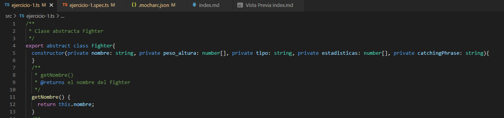

# Práctica 5 - Objetos, clases e interfaces

## Ejercicio 1 - Pokedex
Para este ejercicio, se han realizado 3 clases: ```class Pokémon```, ```class Pokédex``` y ```class Combat``` cuyo objetivo es simular un **combate Pokémon** y tener una **Pokédex** donde almacenar los datos de varios **Pokémon**.

### Clase Pokémon
Esta clase cuenta con 4 métodos **privados** que contienen el nombre de tipo *string*, el peso y la altura almacenados en un *array*, el tipo del Pokémon en un *string* y sus estadísticas (**HP**, **AT**, **DEF**, **VEL**) ordenadas en un *array*. Inicializamos el constructor con los parámetros nombrados anteriormente y realizamos las asignaciones propias.

Continuamos con los métodos getter() y setter() para poder acceder a estos valores desde fuera de la clase. Cabe decir que en los getter de los arrays, se ha optado por poner el array entero y por dividirlos también. En el ejemplo de **Peso y Altura**, tenemos el *getter* del *array* con los dos valores y también los *getter* de solo el peso o solo la altura. Lo mismo sucede con las estadísticas (**getHP()**, **getAT()**, **getDEF()**, **getVEL()**).

**Nota:** Para ahorrar líneas de código, si en el *constructor* asignamos el tipo (**private** / **readonly** / **protected**, etc) a los nombres de los parámetros que recibe la clase, no hace falta realizar la asignación después, es decir que si lo hacemos de esta manera, luego no hay que asignarlos con los **this.nombre = nombre** por ejemplo. 




#### Setters de la clase Pokémon
Para los *setters*, recibimos el tipo de dato a modificar con el método y luego lo cambiamos. En el caso de los *setters* de arrays como en el caso de las estadísticas, se puede modificar el *array* entero introduciendo un *array* de *números* o podemos modificar sólo una de las estadísticas mediante un *number* que modifica luego el *array*. El caso de ```setHP(numero)``` modifica con el *número* introducido el valor **HP** del *array* únicamente. 


### Clase Pokédex
La clase **Pokédex** contiene únicamente un *array* de **Pokémon**, cuyo objetivo es almacenar objetos de la clase **Pokémon**. Además consta de 2 métodos ```getPokemonNumeros()``` que cuenta el número de los **Pokémon** que contiene la **Pokédex** y ```printPokedex()``` que muestra los datos formateados de todos los **Pokémon** que contiene la **Pokédex**.

**Nota:** Para el caso del método ```printPokedex()``` podría ser mejor opción el que se hubiese creado una clase con el mismo nombre que cumpliera su misma función, ya que en los principios **SOLID**, el primer principio: **Single responsibility principle**, las clases deberían realizar una única tarea.  


### Clase Combat
En esta clase se simula un **combate** entre dos **Pokémon**, con lo cual eso será lo que recibe dicha clase. Cuenta con 3 métodos ```entrenadorPokemon1()``` y ```entrenadorPokemon2()``` que es código modificado de la [práctica 3](https://github.com/ULL-ESIT-INF-DSI-2122/ull-esit-inf-dsi-21-22-prct03-types-functions-alu0101068855), [ejercicio 8](https://github.com/ULL-ESIT-INF-DSI-2122/ull-esit-inf-dsi-21-22-prct03-types-functions-alu0101068855/blob/main/src/ejercicio8.ts) concretamente. Estos métodos devuelven el **daño** que le inflige el **pokemon1** al **pokemon2** en el primer caso y el daño del **segundo** al **primero** en el segundo caso. También tiene en cuenta la **efectividad** del ataque, el **AT** del atacante y la **DEF** del defensor.


Finalmente tenemos el método  ```start()``` que simula el combate entre dichos pokémon mostrando los resultados de cada **turno**. Cuenta los turnos y en este caso se ha establecido que la condición por la que se detenga el combate es que uno de los dos acabe con 0 o menos puntos de vida **HP**. 

El **primer Pokémon** ataca y se reescribe el **HP** del segundo mediante la resta del daño calculado por el método ```entrenadorPokemon1()```. Si la vida del segundo es menor o igual a 0, quiere decir que se ha debilitado y por tanto el primero ha resultado victorioso. Si sobrevive, el segundo ataca al primero, realizando la misma metodología, pero con el uso del método ```entrenadorPokemon2()``` y viendo que si el primero resiste o no el golpe. Se repite dicho bucle hasta que haya un vencedor.


En las siguientes imágenes se puede ver cómo sería la simulación del combate entre **Charmander** y **Bulbasur**.


**Nota:** en el guión de la práctica se ha establecido que se debería acabar cuando el daño sea mayor o igual a la vida de uno de los 2 contrincantes. Cambiando el bucle ```while()``` y sumando los daños en vez de restarlos a la **HP**, podríamos lograr este cambio.
Otro posible cambio es el de comparar las **VEL** de los Pokémon para determinar el que empieza el ataque, pero en el guión indica que quien ataca primero es el primero llamado, es decir el primer **Pokémon** y, en este caso, se ha respetado esa condición.

## Ejercicio 1 tests - Pokedex  

Para los test se han comprobado las clases únicamente. Se han creado 3 Pokémon (Bulbasur, Squirtle y Charmander) y se han analizado las clases.


En el caso de la **clase Pokémon** introducimos a Bulbasur y comprobamos que se ha creado el Objeto con los valores introducidos.
Para la **clase Pokédex**, se ha creado una Pokédex de los 3 pokemon y luego se comprueba que se ha generado el array con los 3 pokemon.
Finalmente, se comprueba que se crea la** clase combat** a partir de dos pokemon.


## Ejercicio 2 - Conecta 4

## Ejercicio 2 tests - Conecta 4
